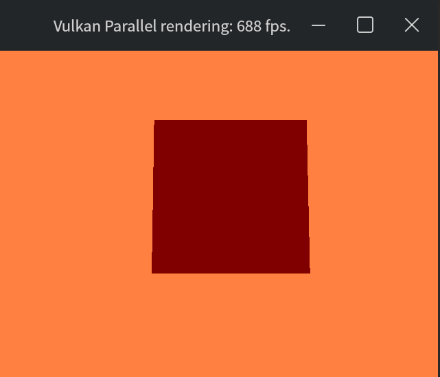

# Vulkan_multiThread
a Vulkan multi-thread renderer that rendering different meshs in parallel.

press W,A,S,D to move camera position
hold mouse left btn to rotate camera front direction
press c to print camera position for debug
press t to print drawing thread info

